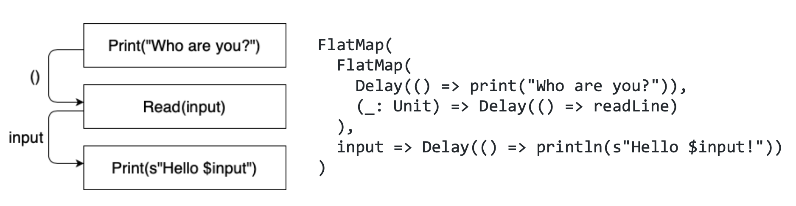

From [wiki](https://en.wikipedia.org/wiki/Fiber_(computer_science)): 

> "Fiber is a particularly lightweight thread of execution."

That's a bit like saying "bicycle is a particularly lightweight car".

Thread is a [well-defined](https://www.cs.uic.edu/~jbell/CourseNotes/OperatingSystems/4_Threads.html) construct within an operating system
(or some emulation like the [JVM](https://sematext.com/glossary/jvm-threads/)). 
Lightweight or not, fiber is not a thread.

So what is it then?

Implementation-wise, fiber is usually a custom programatic construct consisting of two main parts:
- *continuation*, which is basically a stack of operations (function calls) executed by a run loop
- *scheduler*, which submits fibers to the thread pool

Here's an illustration of what the continuation might look like:


Unlike threads which use system resources, 
fibers are just objects on the heap, similar to e.g. your local variables. 
They use no system resources and have a low memory footprint.
If we're talking about the JVM, they can even be garbage collected. This explains the 
"lightweight" part from the wiki definition.

Despite the implementation differences, fiber and thread are conceptually similar - 
they both represent a "path of execution", or a "flow of tasks" if you will. This is what wiki means
when they say that "fiber is a lightweight thread" (even if that might be a bit misleading).

However, there 's an important distinction - fibers and threads work on different levels of abstraction.

```
Fibers
-------
Threads
-------
CPU cores
```

(we could also squeeze in "processes" here, but they are irrelevant in this context since they
don't schedule the threads; they merely consist of threads)

Threads are scheduled to run on CPU cores, and fibers are scheduled to run on threads.
Threads map to CPU cores many-to-few, and fibers map to threads many-to-few.

Important insight here is that **blocking on the higher level means descheduling on the level below**.
When a thread is blocked, the underlying CPU core doesn't get blocked too. Blocking a thread
simply means that it stops being run on the CPU; it is descheduled and another thread is now running in its place.
All that time, CPU keeps running.

Same goes for fibers. Blocking a fiber means that the underlying thread stops running it,
but the thread itself never gets blocked. It just switches to a different fiber. This is an important
insight because it explains why, unlike blocking threads (which is a bad practice), blocking fibers
is totally fine, since nothing gets really blocked under the hood. 

Using the same analogy, you might be tempted to argue that blocking threads is also fine 
because the CPU itself is never blocked. But as mentioned earlier, threads are a system resource. They 
use stuff. Thread pools that run out of available (non-blocked) threads lead to a non-responsive
system. And again - fibers are just objects on the heap. So, having a bunch of wasted threads all around
the place isn't a good idea, but with the fibers we can be a bit more relaxed.

Threads get assigned on the CPU via **preemptive scheduling**, meaning that the OS gets to decide
which thread gets (de)scheduled on the CPU at any given point. 
On the other hand, fibers get assigned on the underlying thread pool via **cooperative scheduling**,
meaning that the fibers themselves yield the "right of way" to each other. 
It is only when one fiber decides to hop off the thread, that another fiber
can hop on and take its place.

How often the yielding happens influences the **fairness vs throughput** trade-off. 
The more frequently fibers are yielded, the more thread time each fiber gets, which
reduces the throughput due to the hop-on-hop-off overhead.

Unlike threads, fibers are not a native construct in any environment. At least not yet; for example,
[Project Loom](https://wiki.openjdk.org/display/loom/Main) intends to introduce *virtual threads*
(your basic fibers) as first class citizens on the JVM.

(this post is based on my [talk](https://docs.google.com/presentation/d/1Em6QLZ_A-N8UBBj6ZbucYSSmyKhI_OQrWUnz_l0KJtk/edit#slide=id.p)
and a [significantly longer text](https://github.com/slouc/concurrency-in-scala-with-ce/blob/master/README.md))
