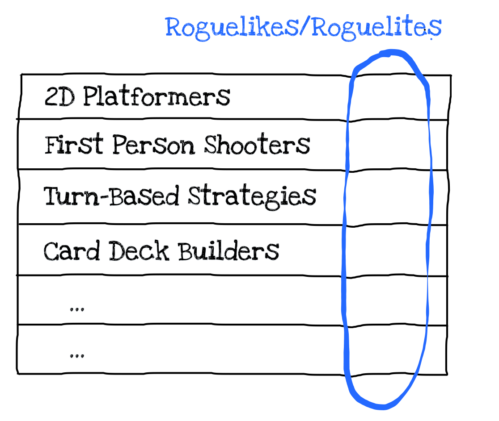

My favorite genre of video games is "roguelike/roguelite". 
The name originates from the 1980 game "Rogue" which inspired the whole thing.
There is an ongoing debate on the difference between "roguelite" and "roguelike", which I have no intention of getting into right now.
I'm going to use the term "roguelike" because it's more widespread and in certain contexts serves as an umbrella term for both subgenres.

Roguelike is technically a genre, but it's kind of orthogonal to the standard genre labels such as RTS or RPG. I'm gonna call it a *meta genre*. 

It is defined by the following mechanics:
- Permadeath: Every time you die, that's it. You start from the beginning. No checkpoints, no save/load.
- RNG: Short from "Random Number Generator". Every run is randomly generated, which includes the level layout, enemy placement, items you find, challenges you face.

This simple, but beautiful idea has resulted in a set of video games whose basic look&feel comes from dozens of other standard genres.
A roguelike might be a 2D platformer, a first-person shooter, a turn based strategy game or a card deck builder.

What makes it a roguelike is the adoption of the permadeath + RNG system.
As a player, you are nudged to get better and better with every failed run, acquiring skills and developing strategies
until you eventually win. And once you do, the RNG makes you want to play more, because no two runs are the same. 
So you continue playing, constantly facing new challenges and further developing skills and tactics with every attempt, 
similar to how nobody stops playing chess after their first victory.

I've noticed that meta genres exist in other places too. 
Let's take music for example. 
Muse, one of my favorite rock bands, are known for including elements of many different music genres, 
from cheesy commercial pop, to electronic dance music, progressive rock, classical, heavy metal... 
They even have a dubstep song.
What if they actually have a hidden ingredient just like roguelike games do, 
something that makes them Muse no matter what they sound like on the surface?
What if Muse have figured out this particular thing that strucks a particular chord with so many people, and makes them
enjoy the band's creative output across so many seemingly totally unrelated genres?

When it comes to books/movies/TV shows, my favorite example is Sci-Fi.
How do we explain that same groups of people enjoy movies like Alien and Her? 
Or shows like Star Trek and Red Dwarf? Or books like Dune and The Hitchiker's Guide to the Galaxy?
Seems like Sci-Fi is actually a meta genre, a common denominator that spans across many "standard" genres,
from thriller and horror to romance and comedy.

One meta genre I personally really like is "movies with the plot set in a single location".
I don't mean New York City of course, but something like a single room. 
Examples are Carnage, Buried and Phone Booth, three
completely different movies across three different classic genres.

Fun stuff.
