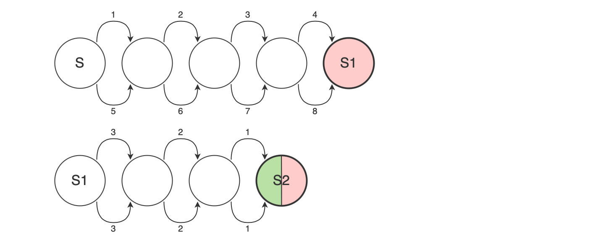

Here's a simple, but effective proof that palindromes are not a 
[regular language](https://en.wikipedia.org/wiki/Regular_language).

It's known as the [Myhill–Nerode theorem](https://en.wikipedia.org/wiki/Myhill–Nerode_theorem).

This can be proven by verifying that the check if string is a palindrome cannot be implemented 
using deterministic finite automaton (DFA). We will suppose that such DFA exists
and then reach logical contradiction, thereby proving it cannot actually exist.

Proof:

Since there is an infinite number of strings and a finite number of DFA states, there have to exist 
two different strings that reach the same state 
(this is a logical conclusion, but it's formally known as the [pigeonhole principle](https://en.wikipedia.org/wiki/Pigeonhole_principle)).

Without loss of generality, we can pick some arbitrary representations for these strings:

*A* = "1234", *B* = "5678"

Now: 
- We posited that both inputs *A* and *B* reach the same state *S1* in our DFA
- By appending the same character sequence *C* to each string, they will both reach some state *S2*
(DFA has no memory of input, it just follows the transitions from *S1*)
- Let's take *C* = "321".
  - For *AC* ("1234321"), end state *S2* should be **accepting**
  - For *BC* ("5678321"), end state *S2* should be **non-accepting**

We reached a contradiction; *S2* cannot be both accepting and non-accepting.