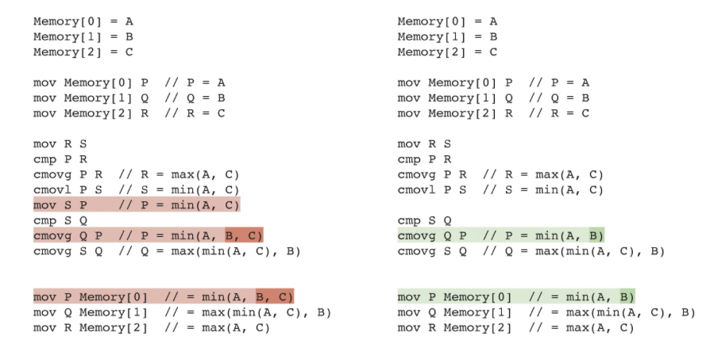

Yesterday, DeepMind [announced](https://www.nature.com/articles/s41586-023-06004-9) that their AI 
(more specifically DRL) managed to find alternative sorting
algorithms which outperform current state-of-the-art.

Of course, as it turns out, there was no actual new sorting algorithm invented. But it's still
an interesting finding. Basically what they did was, they focused on so-called "small sorting algorithms"
(usually 2-4 items), both of fixed (also known as [sorting networks](https://en.wikipedia.org/wiki/Sorting_network)) and variable length.

Each algorithm was represented as an assembly program, and the AI played a self-reinforcing single player game of
"shuffle the assembly instructions around until a more performant algorithm is found" (e.g. one
that uses fewer commands). We went from inventing a new sorting algorithm, to finding
architecture-specific assembly code micro-optimisations. Still interesting stuff though!

Here are some examples of the improvements AI found.

First, we're looking at `VarSort4` - algorithm for sorting variable length arrays up to four elements big.
Old high-level algorithm looked like this (in pseudocode):
```
if (s.length == 4) sort4(s)
else if (s.length == 3) sort3(s)
else if (s.length == 2) sort2(s)
return s
```

AI-improved algorithm looks like this:
```
if (s.length == 2) sort2(s)
else {
  sort3(s)
  if (s.length == 4) insert_sorted(s[3], s)
}
return s
```

where `insert_sorted` is a simple single-step insertion sort for putting the fourth element
into its right location within an already sorted three-element array (done in the previous line).

Here's another example:



Without going into too much detail, it figured out that it can perform a simpler `min(A, B)` 
instead of `min(A, B, C)` because at that point `B <= C` is guaranteed. Feel free to verify it.

But what I actually wanted to discuss is a more general idea: "The generality of an AI algorithm".

Sure, this reinforced learning method can keep shuffling these instructions around, removing them
and introducing new ones, having a simple reward function based on, say, sorting runtime. 
But did this AI model really *learn* how to optimize sorting algorithms? Actually, that for sure 
didn't happen, let me rephrase - did this AI model really *learn* how to optimize assembly code?

I don't think it did. I'm going to pull a parallel to playing chess. You know how DeepBlue
famously beat Kasparov almost 30 years ago, and how Stockfish manages to kick your ass even
on lower levels? Well, the analogue of what happened in this paper would be:
- The algorithm analyzed Byrne vs Fischer, 1956 and found a quicker checkmate.
- The algorithm analyzed Karpov vs Kasparov, 1985 and found a more elegant move.
- etc

Following the analogy, in our case there's no model that learned  how to optimally 
play chess. It's more like, every time we'd want to
analyze a certain chess situation, we'd need to feed it the current list of moves, 
and it would shuffle them around
feeding them back into its reinforced learning algorithm, until a better 
(by whatever criteria) sequence is found.

DeepMind is awesome,
but sometimes they tend to overhype their findings. 
We managed to squeeze some extra juice out of current LLVM C++ small sort implementations,
that's great, but we're still far away from asking the AI to come up 
with a completely novel sorting algorithm.

Doesn't mean it won't happen!