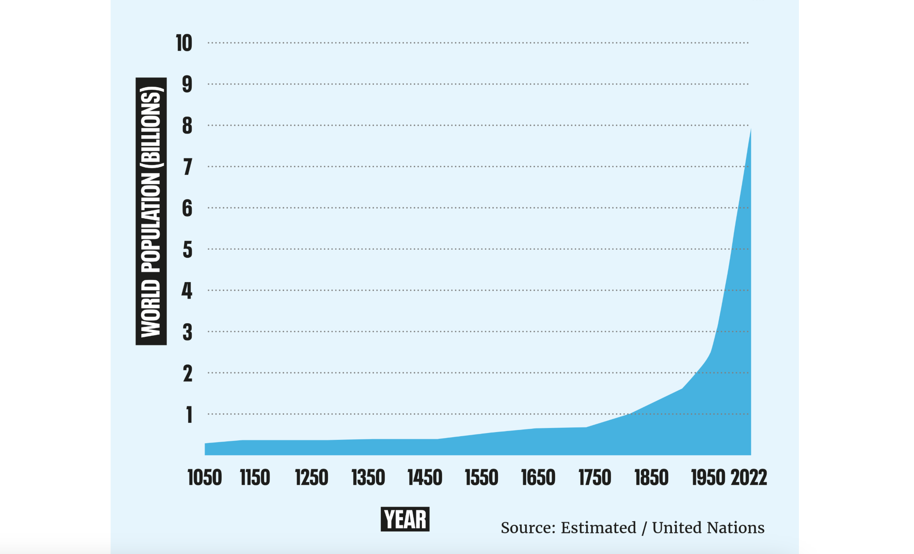
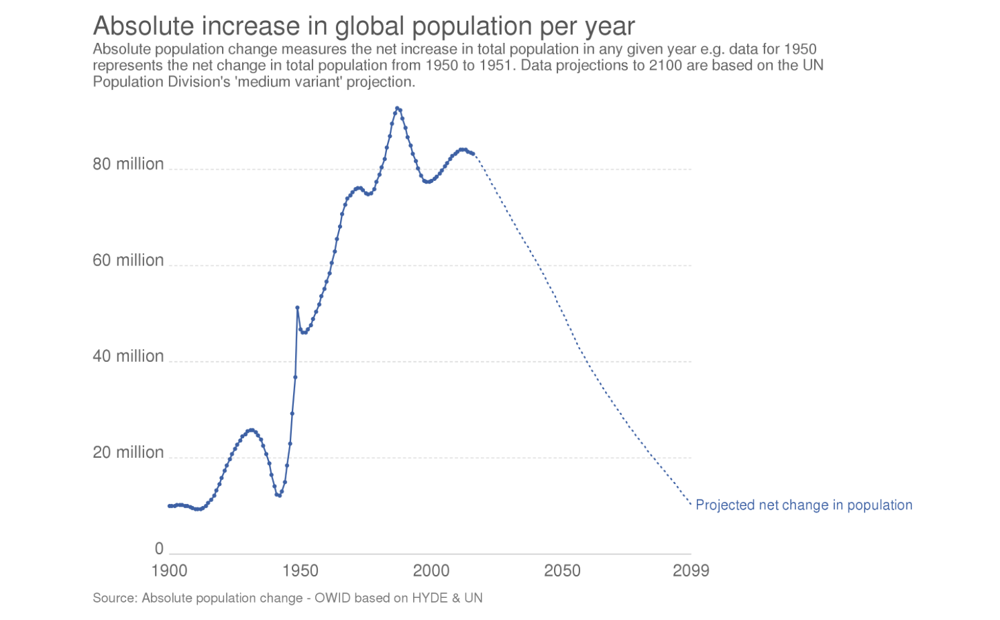
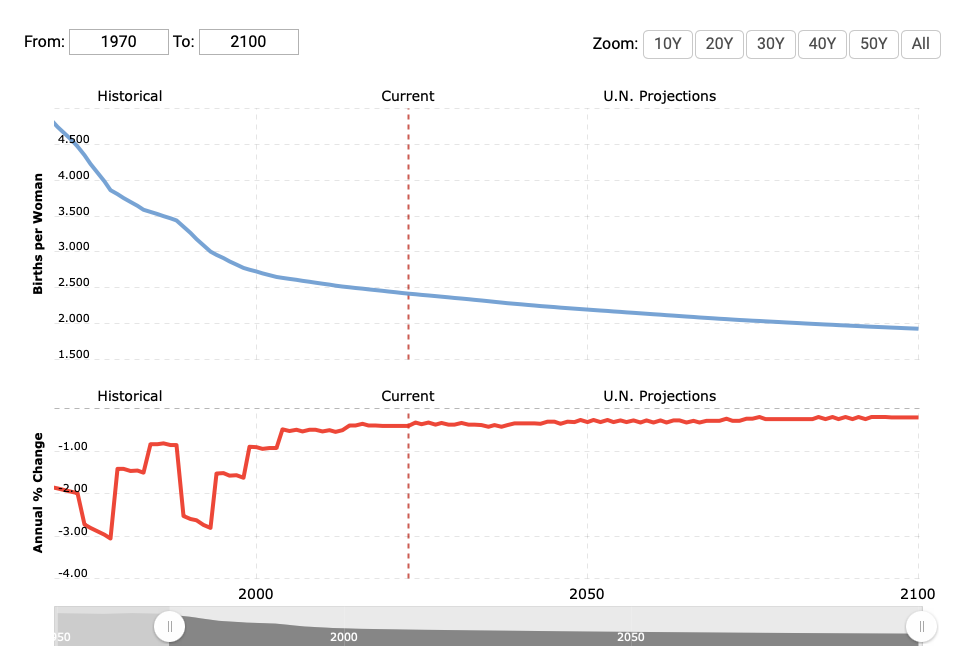
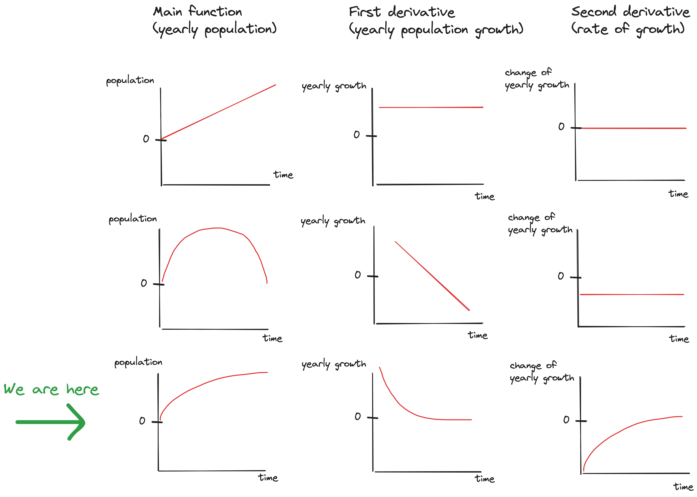

You can often hear people saying "we are overpopulated" followed by "with this level of growth 
we will be at XY billion in the next few years".

Why does everybody think that? Well, people recognize trends.
What else are you supposed to think when you see this:

It's a common fallacy to try and predict future numbers based on the
current ones, without considering that things can change
(just remember how, until 2007-2008, everyone firmly believed that "housing prices can only go up").

Also, it's common to hear "China is growing rapidly, therefore they have a one-child policy".
Yes, that used to be true. But did you know that:
- In October 2015, China switched to a two-child policy
- In May 2021, China raised that to a three-child policy
- In July 2023, China announced removing any kind of child policy

That's another common fallacy - to learn some truth about the world, and never bother to re-evaluate
it again.

Here's a better example: a common misconception that "non-Western World" 
countries (whatever that actually means)
are still having lots and lots of children.

I arbitrarily picked some countries that fit into this stereotype.
Let's look at their fertility rates (FR):

| Country   | FR in 1970 | FR in 2023 |
|-----------|------------|------------| 
| India     | 5.598      | 2.139      | 
| Pakistan  | 6.600      | 3.238      | 
| Jordan    | 7.913      | 2.575      | 
| Kenya     | 8.062      | 3.259      | 
| Mexico    | 6.578      | 2.027      | 
| Vietnam   | 6.411      | 2.019      | 
| Morocco   | 6.670      | 2.296      | 
| Colombia  | 5.404      | 1.727      | 
| The World | 4.744      | 2.418      | 

(source: [Macrotrends.net](https://www.macrotrends.net/countries/WLD/world/fertility-rate))

[Replacement rate](https://en.wikipedia.org/w/index.php?title=Total_fertility_rate#Replacement_rates) 
is the average number of children each couple should have
to sustain the same population in the next generation. For developed countries this value
is considered to be 2.1, which makes sense - if N people form N/2 couples, 
each couple would need (on average) two children to keep the number at N, assuming that the
average ratio of boys and girls is approximately 50:50. Some of those children will not live
long enough to procreate and contribute to the follow-up generation, 
so the number is raised from 2.0 to 2.1. 
In developing / undeveloped countries, assumed value of replacement rate can go as high as 3.5 
due to much higher child mortality rates. Of course, none of this
is exact math, but it's a useful approximation.

Look at the fertility rates in the "2023" column.
All of them are either approaching 2.1, or they are already below. 
Kenya sits a bit higher, like many other African countries, but they all dropped from 7-8 
during the last five decades.

If we are seeing such a steady decline in fertility rates, why is the global population still rising? 
Because of the advances in modern medicine and other
quality-of-life improvements, combined with the fact that 
we've had a relatively peaceful period from boomers onwards. This means
that the new generations are being born, but old generations are not dying out. Yet.

So what's waiting for us in the near future? 

For this, I will use some math and some pictures:

_Image 1:  Projection of the global population growth_

 

_Image 2: Projection of the global fertility rate_

 

_Image 3: Population function and its derivatives_

 

This is my observation:

- Yearly increase in the global population is positive. We are growing in numbers.
If the growth (= first derivative of the global population) were constant,
then the line representing our global population number would linearly increase.
This situation is shown in image 3, first row.
- However, projections are showing that the growth is about to start going down (image 1). This is 
 correlated with the drop in fertility rates discussed earlier. If the growth goes down linearly
the way it's projected in image 1, it would eventually cross 0 and
at that point our global population would start decreasing. This situation is shown in image 3,
second row.
- Growth will most likely not drop in linear fashion though. If we take a look at the global
fertility rate projection (image 2), we can see that there is a slowdown. Fertility rate
*should* have a high correlation (and probably even causality) with the yearly growth, and we
can use it as a predictor for upcoming population growth movement. More babies - more people.
Fewer babies - fewer people.
- So my take is: if the growth indeed follows the fertility rate, that means we'll arrive at a 
stable population, at which point its first and second derivative are approaching zero.
  This situation is shown in image 3, third row. Notice how the growth function in the middle column
follows the trend we saw in the global fertility rate in image 2, because I assume
they are highly correlated. And if this is indeed the case, then our global population function
will take the logarithmic "slowdown" shape as seen in the left column.

So if I had to guess, I'd say that we will stabilize somewhere near the replacement rate 
within the next few decades. And a hundred years later, for the first
time in history, kids in school will get a very similar answer to "how many people are there on Earth?" 
as their parents and grandparents did. Where do we go from there - I have no idea.