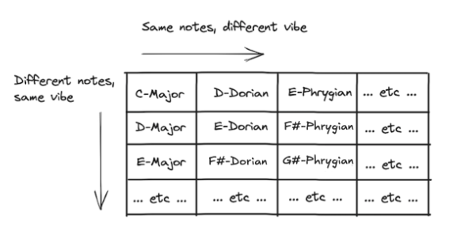

When you listen to some melody, your brain doesn't perceive the notes in terms of their absolute pitch.
Instead, it perceives each note based on how far away it is from the [tonic](https://en.wikipedia.org/wiki/Tonic_(music)) -
the first (or root) note of the scale. Tonic is the anchor everything revolves around.
Our brain particularly likes it when the melody ends (or "resolves") on the tonic.

"Twinkle twinkle
little star" can be played starting from any note (C, D, E, etc.), as long as it's played like this
(counting only the notes of the major key and not the semitones in between):
```
1st, 1st, 5th, 5th, 6th, 6th, 5th, [pause], 4th, 4th, 3rd, 3rd, 2nd, 2nd, 1st
```

If you play the melody starting from C, and then you
play the same melody starting from G, both times it's going to sound correct. But if you e.g. move the 
third note in that sequence from `5th` to `6th`, it's going to ruin
the familiar melody. And if you really want to mess with it, 
change that last `1st` to something else.

Let's make up a simple melody of our own:

<figure>
    <audio
        controls
        src="../audio/c_major_mode.mp3">
            <a href="../audio/c_major_mode.mp3">
                Download audio
            </a>
    </audio>
</figure>

I'm playing a C-Major chord in the background, and I'm resolving onto a tonic (C).
These two things give
our brain plenty of context to perceive this melody to be in the key of C-Major.

Now let's see what happens if I play the *exact same melody*, 
using *exact same notes*, but over an E-minor chord.
Additionally, I will also modify the last
note of the melody, so that it gets resolved to its new tonic - the E note.

<figure>
    <audio
        controls
        src="../audio/e_phrygian_mode.mp3">
            <a href="../audio/e_phrygian_mode.mp3">
                Download audio
            </a>
    </audio>
</figure>

It's not so easily noticeable in this oversimplified context, especially if you hear it right
after major (so your brain is still biased),
but hopefully you'll recognize that it sounds
more exotic. That's because we're now in the key of *E-Phrygian*.

Phrygian is often described as being
the bread & butter of Middle-Eastern music and Spanish flamenco.
It's actually popular across many other music genres, metal being a very prominent one.
It tends to be described as sounding somewhat "dark" or "tense".

In the case of our made-up melody, we retained the same notes in both cases, but by changing the harmonic context,
we are tricking our brain into a different perception
of the melody. Imagine having a grey tile on a white surface; we would perceive the tile as being "dark".
If we see that same tile with the same shade of grey on a black surface, we would perceive it as "light".

Similarly, our melody consists of the same notes as before, but now it's in a different setting.
C note is no longer the anchor; E is. Other notes have their
roles changed as well: for example, F no longer plays the role of being the fourth note of the key (C -> D -> E -> F).
Now it's the second one (E -> F).
Quoting myself from earlier: "[your brain] perceives each note based on how far away it is from the tonic".

Of course, you can't just change these things willy-nilly. If I had played a different chord in the background,
one that doesn't happen to "fit" with the given melody (such as E-Major instead of E-minor), 
we would have ended up in a weird out-of-tune place. But this example worked. 

And here's why: 
- Looking at the chords, C-Major chord (CGE) and E-minor chord (EGB) both use notes from the C-Major scale. E-Major (EG#B) doesn't work.
- Looking at the entire C-Major scale, `C-D-E-F-G-A-B-C`, and comparing it to the E-minor scale, `E-F#-G-A-B-C-D-E`, we can see that there's a mismatch in F vs F#. 
E-minor chord works fine within the C-Major scale because it doesn't use F#; it only uses E, G and B.
- However, scales of C-Major and E-Phrygian share the exact same set of notes (CDEFGAB)!
Next time someone sees you poking at only the white keys on a piano and teases you about playing
in the most basic key of C-Major, you can explain that you're actually playing in E-Phrygian.
Just make sure your melody revolves around E instead of C.
- E-minor chord makes sense within the E-Phrygian scale for the same reason it makes sense within the C-Major scale 
(as we just discovered, E-Phrygian and C-Major scales share the same notes).


    
    

This brings us to the concept of a **"hole pattern"**.

Let's look at the placement of our C-Major notes within the entire 12-note diatonic scale.
The interval ("hole") between two subsequent notes
is a half step, denoted `H`. When there is a non-C-Major note in between, e.g. `C#`
between `C` and `D`, we skip that note, and we count that hole as two half steps, or one whole step, denoted as `W`.

For C-Major, which consists of the notes `C-D-E-F-G-A-B-C`, the hole pattern looks like this:
```
C C# D D# E F F# G G# A A# B C
| w  | w  |h| w  | w  | w  |h| 
```

The pattern for *any major scale* is `W-W-H-W-W-W-H`.


E-Phrygian also starts from E, but it retained the C-major notes (`E-F-G-A-B-C-D`), 
and therefore has the following hole pattern:
```
E F F# G G# A A# B C C# D D# E 
|h| w  | w  | w  |h| w  | w  |
```
E-Major retained the holes and got its notes changed.
E-Phrygian retained the notes and got its holes changed.
Something has to give; the only key with the same notes as C-Major, AND the same holes as C-Major... is C-Major.

Taking a closer look at the Phrygian case, it seems as if the major scale got "rotated" by two places.
Everything stayed the same, we just changed our starting point. This is intuitively relatable with
our exercise from earlier, playing the same notes while using a different tonic (because the tonic _is_ the starting point).


But this brings a very significant change to how we perceive music in this key, because the hole pattern
now reads totally differently - from `W-W-H-W-W-W-H`, it became `H-W-W-W-H-W-W`.

Let's check all the combinations we can arrive at by rotating the major scale hole pattern one place at a time.

Ladies and gentlemen, these are your **modes of the major scale**:
```
hole pattern    mode               another useful visualisation:
                                      
W-W-H-W-W-W-H   Ionian (major)      W-W-H-W-W-W-H
W-H-W-W-W-H-W   Dorian                W-H-W-W-W-H-W
H-W-W-W-H-W-W   Phrygian                H-W-W-W-H-W-W
W-W-W-H-W-W-H   Lydian                    W-W-W-H-W-W-H
W-W-H-W-W-H-W   Mixolydian                  W-W-H-W-W-H-W 
W-H-W-W-H-W-W   Aeolian (minor)               W-H-W-W-H-W-W 
H-W-W-H-W-W-W   Locrian                         H-W-W-H-W-W-W 
```

As you can see, the two most popular keys in the western music,
major and minor, are nothing but two modes of the same scale, called Ionian and Aeolian respectively.
Don't get bogged down in whether major is the mode of minor, or vice versa; they are
all equal, seven different rotation positions of the same blueprint. Ionian just happens to be the most popular one.

Let's go from C-Major and start rotating. You can observe how the holes are basically just following
the arrangement of notes on each rotation; one is the consequence of the other. You can think of rotating
the note order and the holes following along, or rotating the hole pattern and the notes following along.
Two sides of the same coin.

```
notes            hole pattern      mode                

C-D-E-F-G-A-B    W-W-H-W-W-W-S     C-Ionian (major)    
D-E-F-G-A-B-C    W-H-W-W-W-H-W     D-Dorian    
E-F-G-A-B-C-D    S-W-W-W-H-W-W     E-Phrygian    
F-G-A-B-C-D-E    W-W-W-H-W-W-S     F-Lydian  
G-A-B-C-D-E-F    W-W-H-W-W-H-W     G-Mixolydian    
A-B-C-D-E-F-G    W-H-W-W-H-W-W     A-Aeolian (minor)  
B-C-D-E-F-G-A    S-W-W-H-W-W-W     B-Locrian       
``````

This is why C-Major (or C-Ionian) shares the same notes as E-Phrygian. Same notes, but a
different hole pattern, giving a different vibe. Remember, "the vibe" comes from the hole pattern.



Note that C-Major is significantly different from C-Phrygian. They don't share the same set of notes (like
C-Major and E-Phrygian do),
nor do they share the same hole pattern (like C-Major and D-Major do). 
All they share is the tonic and, well, some of the notes. Homework
assignment: using the rotation technique, figure out which major key shares its notes with C-Phrygian.

It is not uncommon for people to be unable to agree which mode some piece of music is in. This
happens when there is not enough harmonic context, so the mode becomes ambiguous and therefore subjective. 
One example that comes to mind is [Daft Punk's "Get Lucky"](https://slate.com/culture/2014/03/daft-punks-get-lucky-explained-using-music-theory.html)
(my vote goes to B-Dorian here). For some songs, however, the mode is very clear.
Joe Satriani's "Flying In A Blue Dream" is schoolbook Lydian.

Quick recap: C-Major and E-Phrygian are two modes of the same key. They share the exact same
notes, but because of a different starting point (tonic), jumping around those notes yields
a different hole pattern. For example, in order to go from the tonic to the second note of the key,
C-Major requires a whole step (C -> D), while E-Phrygian requires a half step (E -> F). If you would
instead make a whole step (E -> F#), you would break away from the established "C Major" set of notes, and
therefore you would no longer be in any of its modes.

What happens when we compare C-Major to C-Phrygian?
They both start with C, but they differ in some of the notes, which means they also have different
hole patterns; for example, first three notes of each are C-D-E and C-C#-E respectively, making the
hole pattern W-W vs H-W. And because of the different hole pattern, even in those first three notes,
they give off a different vibe already:

<figure>
    <audio
        controls
        src="../audio/major_three_notes.mp3">
            <a href="../audio/major_three_notes.mp3">
                Download audio
            </a>
    </audio>
</figure>


<figure>
    <audio
        controls
        src="../audio/phrygian_three_notes.mp3">
            <a href="../audio/phrygian_three_notes.mp3">
                Download audio
            </a>
    </audio>
</figure>

OK, moving on. Here's another very cool thing: **there are other hole pattern "blueprints" too!** You can
take one and start rotating it, discovering a completely new set of modes.

Let's take a look at the good old natural minor scale (= Aeolian mode) with its hole pattern `W-H-W-W-H-W-W`,
and let's tweak it a bit.
This time I don't mean rotating; let's "force" it into a hole pattern
that *cannot* be obtained by rotating. We want to break the standard mould.

Looking at the usual Aeolian hole pattern:
```
A A# B C C# D D# E F F# G G# A
| w  |h| w  | w  |h| w  | w  |
```

we can modify it into this:
```
A A# B C C# D D# E F F# G G# A
| w  |h| w  | w  |h| w+h  |h |
```
We shifted the bracket from G to G#, and by doing so, we 
created one big gap between F and G# which never existed before.
We never had a hole that was three semitones wide (denoted above as `w + h`),
therefore we couldn't have arrived at this hole pattern from the major scale, not matter how much we rotated it.

By doing this change, we have turned our natural minor into a *harmonic minor*.

Rotating this hole pattern yields a [whole new set of beautiful modes](https://en.wikipedia.org/wiki/Harmonic_minor_scale#Modes_of_harmonic_minor_scale), such as "Ukrainian Dorian" or "Super-Locrian".
But my favorite of that bunch is the Phrygian Dominant. It's similar to the standard Phrygian we
explored already, but it brings much more accent to the "Middle-Eastern sound" (as Western-music fans like to call it).

Phrygian Dominant has the following hole pattern: `H-WH-H-W-H-W-W`, with `WH` being the "big gap" we 
saw with the harmonic minor (but now being in a different spot relatively to the tonic, due to rotation).

Let's hear our original E-Phrygian melody once more:

<figure>
    <audio
        controls
        src="../audio/phryg_melody.mp3">
            <a href="../audio/phryg_melody.mp3">
                Download audio
            </a>
    </audio>
</figure>

And now let's create that "big gap" by widening the second hole by an additional half step
(and consequently narrowing the third hole by half a step).
We are now breaking away from our usual mould consisting of seven modes of the major scale. We
are in a different universe, rotating around a completely new set of modes.

Here is the Phrygian Dominant:

<figure>
    <audio
        controls
        src="../audio/phryg_dom_melody_1.mp3">
            <a href="../audio/phryg_dom_melody_1.mp3">
                Download audio
            </a>
    </audio>
</figure>

Makes a world of difference, doesn't it? 
Don't jump to a conclusion that it's that raised G# note that makes the difference on its own. Key of E-Major
has that same note, and yet doesn't have the same vibe. It's not the note itself, but the gap that precedes it.
It's all about the hole pattern!
 
Staying in Phrygian Dominant, let's slightly tweak the second part of the melody to linger around that
third note a bit longer, hopping briefly to fourth and back for even more dramatic effect.

<figure>
    <audio
        controls
        src="../audio/phryg_dom_melody_2.mp3">
            <a href="../audio/phryg_dom_melody_2.mp3">
                Download audio
            </a>
    </audio>
</figure>

It's like music from "One Thousand And One Nights"!
But it can also be used in other contexts too.
For example, Muse's "Stockholm Syndrome" intro riff is, you guessed it - Phrygian Dominant. 
It doesn't really sound Arabic or Spanish to me.
That's the beauty of modes - not only do they make music more interesting,
but they are also versatile enough to be incorporated anywhere, instead of being tied to a particular genre.

That's all for now! Thanks for getting this far, 
and consider further exploring this rabbit hole for yourself. It's highly rewarding.