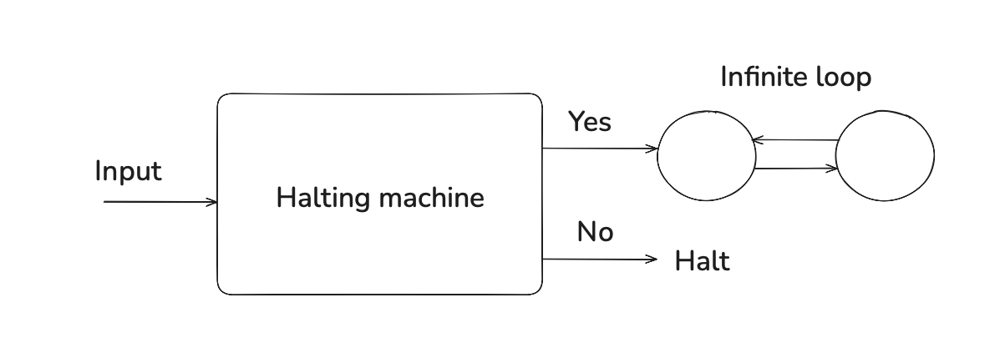

The year is 1928. David Hilbert and Wilhelm Ackermann pose a question - given any statement in formal logic,
is there an algorithm that can answer it with "yes" or "no"? This depends on the idea that logic is complete -
every provable statement is true, and every true statement is provable.

It has two equivalent definitions:
- Is there an algorithm to determine if input statement is true?
- Is there an algorithm which, given a set of axioms and a mathematical proposition, 
decides whether it is provable from the axioms?

To make it less hand-wavey, a formal definition of an "algorithm" was needed. In 1935-36, the concept of
*effective calculability* was defined independently by Alonzo Church (using Lambda-calculus) and Alan Turing
(using Turing machines). Both Church and [Turing](https://www.cs.virginia.edu/~robins/Turing_Paper_1936.pdf)
give a negative answer to the Entscheidungsproblem. 

Their work was heavily influenced by Kurt Gödel's earlier work from 1930-31, more specifically
his two "Incompleteness theorems" which show that
1. Any consistent system capable of expressing arithmetic can never be complete.
2. Such system can not prove its own consistency.

Gödel came up with a class of functions,
known as *recursive functions* (later named *primitive recursive functions*) to model his formal theory,
and then he used [Gödel numbers](https://en.wikipedia.org/wiki/Gödel_numbering)
to construct a formal version of "this statement is not provable", 
basically [Liar paradox](https://www.google.com/search?client=safari&rls=en&q=liar+paradox&ie=UTF-8&oe=UTF-8)
but using "provable" instead of "true".

Gödel was focused on the foundations of mathematics and showing the limitations of formal systems, but his
work was more directly relevant to the world of computability theory. His recursive functions were
shown to be equivalent to lambda calculus and Turing machines, and all three undecidability proofs
were based on the same self-referential idea. Indeed, Turing's halting problem paradox is a yet another
flavor of the Liar paradox:

Hilbert was defeated. And on three different accounts, using three different (but equivalent) proofs.